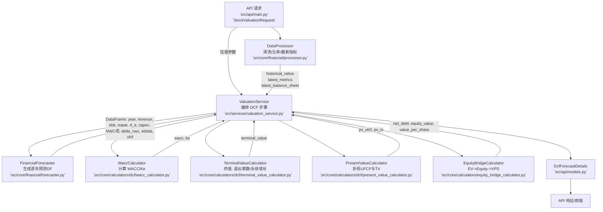

# DCF 核心业务逻辑与架构

本文档概述本项目中 DCF 估值的核心业务流程、关键模块与数据流，并给出整体与子模块的架构图（Mermaid）。

## 总体架构



## WACC 计算子流程

```mermaid
flowchart LR
    subgraph Inputs
    P1[参数: risk_free_rate, beta, market_risk_premium, size_premium, country_risk_premium, industry_risk_premium, cost_of_debt, tax_rate]
    P2[权重模式: target 或 market]
    P3[目标债务比例 target_debt_ratio]
    P4[最新市值 market_cap & 资产负债表]
    end

    P1 --> W{WaccCalculator}
    P2 --> W
    P3 --> W
    P4 -->|market 模式\n债务市值近似账面| W

    W -->|Ke = Rf + β*(MRP+CRP) + Size + Industry| Ke[Ke]
    W -->|Kd(AT) = Kd*(1-T)| Kd[税后债务成本]
    W -->|权重: target 或 market| WT[Equity/ Debt 比例]
    Ke --> X[WACC = E*Ke + D*Kd(AT)]
    Kd --> X
    WT --> X
```

## 关键模块职责与输入/输出

- `DataProcessor`（数据准备）
  - 输入：原始三大报表、基本信息、PE/PB、股息、价格等
  - 输出：`processed_data`（清洗后的报表）、`historical_ratios`（中位数/天数）、`latest_metrics`、`latest_balance_sheet`
- `FinancialForecaster`（财务预测）
  - 输入：上一年度收入、历史比率、预测假设（利润率/各项比率与天数/过渡年数等）
  - 输出：含逐年 `year, revenue, ebit, nopat, d_a, capex, NWC 分项, delta_nwc, ebitda, ufcf` 的 DataFrame
- `FcfCalculator`（UFCF）
  - 公式：`ufcf = nopat + d_a - capex - delta_nwc`
  - 就地回填 `ufcf` 列（Decimal 计算，异常/NaN 防护）
- `WaccCalculator`（WACC/Ke）
  - Ke（增强 CAPM）：`Ke = Rf + β*(MRP + CRP) + Size + Industry`
  - 债务成本税后：`Kd(AT) = Kd*(1 - Tax)`
  - 权重：`target`（`target_debt_ratio`）或 `market`（以市值/账面债务近似求权重）
  - 返回：`(wacc, ke)`；含大量类型/范围校验与回退
- `TerminalValueCalculator`（终值）
  - Exit Multiple：`TV = EBITDA_T * ExitMultiple`
  - Perpetual Growth：若启用 GDP 上限，`g = min(g_input, GDP_CAP)`；要求 `g < wacc`
    - 公式：`TV = UFCF_T * (1 + g) / (wacc - g)`
- `PresentValueCalculator`（现值折现）
  - 年中折现可选：指数 `t-0.5`
  - 输出：`pv_ufcf` 与 `pv_tv`（Decimal 逐期折现并汇总）
- `EquityBridgeCalculator`（股权桥）
  - `NetDebt = (LT/ST 借款 + 债券 + 一年内到期非流动负债) - 货币资金`
  - `EquityValue = EV - NetDebt - MinorityInterest - PreferredEquity`
  - `Value/Share = EquityValue / TotalShares`
- `ValuationService`（编排与防护）
  - 顺序：预测 -> WACC -> 终值 -> 现值 -> 股权桥 -> 汇总 `DcfForecastDetails`
  - 逻辑：API 假设键映射、市场权重失败回退目标权重、默认 ExitMultiple/PGR、`g<w` 守护、调试快照、敏感性分析

## 环境变量与默认

- `WaccCalculator`：`DEFAULT_BETA`, `RISK_FREE_RATE`, `MARKET_RISK_PREMIUM`, `COUNTRY_RISK_PREMIUM`, `INDUSTRY_RISK_PREMIUM`, `DEFAULT_COST_OF_DEBT`, `DEFAULT_TARGET_TAX_RATE`, `DEFAULT_SIZE_PREMIUM`, `TARGET_DEBT_RATIO`
- `TerminalValueCalculator`：`USE_GDP_CAP`（默认为 true），`GDP_NOMINAL_CAP`（默认 0.05）
- `ValuationService`：`DEFAULT_EXIT_MULTIPLE`（默认 8.0），`DEFAULT_PERPETUAL_GROWTH_RATE`（默认 0.025）

## 主要数据流与产出

1. DataProcessor 清洗数据、计算历史中位数/天数与最新指标
2. FinancialForecaster 基于历史与假设生成逐年预测，`FcfCalculator` 填充 `ufcf`
3. WaccCalculator 计算 `wacc, ke`（支持 market/target 权重）
4. TerminalValueCalculator 计算终值（Exit Multiple 或 Perpetual Growth，含 GDP 上限与 `g<w` 校验）
5. PresentValueCalculator 将 UFCF 与 TV 折现为现值（可年中折现）
6. EquityBridgeCalculator 计算净债务、股权价值、每股价值
7. 汇总为 `DcfForecastDetails` 返回 API/前端

## 参考代码位置

- Valuation 编排：`src/services/valuation_service.py`
- WACC/终值/现值/UFCF/股权桥：
  - `src/core/calculators/dcf/wacc_calculator.py`
  - `src/core/calculators/dcf/terminal_value_calculator.py`
  - `src/core/calculators/dcf/present_value_calculator.py`
  - `src/core/calculators/dcf/fcf_calculator.py`
  - `src/core/calculators/equity_bridge_calculator.py`
- 预测器/数据处理：
  - `src/core/financial/forecaster.py`
  - `src/core/financial/processor.py`
- DCF 结果模型：`src/api/models.py`
```
