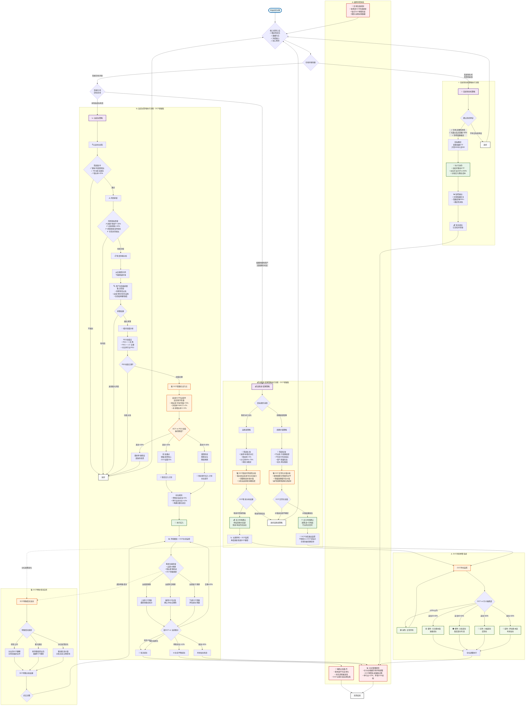

```mermaid
graph TD
    %% 起始节点
    START([开始投资决策]) --> MINDSET{核心投资心法<br/>✓ 确定性优先<br/>✓ 数据为王<br/>✓ 风控核心<br/>✓ 耐心等待}
    
    %% 市场环境判断
    MINDSET --> ENV_CHECK{市场环境判断}
    
    %% 三大策略分支
    ENV_CHECK -->|系统性危机<br/>恐慌性暴跌| CRISIS_STRATEGY[🔥 系统性危机策略]
    ENV_CHECK -->|常规市场环境| NORMAL_MARKET{常规市场<br/>目标选择}
    
    NORMAL_MARKET -->|寻找高成长机会| GROWTH_STRATEGY[📈 高成长策略]
    NORMAL_MARKET -->|配置防御性资产<br/>或周期性机会| VALUE_STRATEGY[💰 高股息/蓝筹策略]

    %% :highlight[]:highlight[]:highlight[]:highlight[]:highlight[]:highlight[]:highlight[]:highlight[]:highlight[]:highlight[]:highlight[]:highlight[]===
    %% 系统性危机策略分支（无需DCF）
    %% :highlight[]:highlight[]:highlight[]:highlight[]:highlight[]:highlight[]:highlight[]:highlight[]:highlight[]:highlight[]:highlight[]:highlight[]===
    subgraph CRISIS_FLOW ["🔥 系统性危机策略执行流程"]
        CRISIS_STRATEGY --> C1{确认危机特征}
        C1 -->|✓ 市场非理性恐慌<br/>✓ 大盘从高点回撤>30%<br/>✓ 恐慌指数极高| C2[目标确定:<br/>宽基指数ETF<br/>沪深300/中证500]
        C1 -->|不符合危机特征| REJECT1[放弃]
        
        C2 --> C3[🎯 执行动作:<br/>• 加杠杆重仓ETF<br/>• 仓位可达150%-200%<br/>• 分批买入降低成本]
        C3 --> C4[📊 监控退出:<br/>• 市场情绪修复<br/>• 指数反弹20%+<br/>• 确定性消失]
        C4 --> C5[💰 坚决减仓<br/>归还杠杆资金]
    end

    %% :highlight[]:highlight[]:highlight[]:highlight[]:highlight[]:highlight[]:highlight[]:highlight[]:highlight[]:highlight[]:highlight[]:highlight[]===
    %% 高成长策略分支（重点DCF应用区域）
    %% :highlight[]:highlight[]:highlight[]:highlight[]:highlight[]:highlight[]:highlight[]:highlight[]:highlight[]:highlight[]:highlight[]:highlight[]===
    subgraph GROWTH_FLOW ["📈 高成长策略执行流程 - DCF增强版"]
        GROWTH_STRATEGY --> G1[🔍 自动化初筛]
        G1 --> G1A{筛选条件<br/>✓ 营收/利润双增长<br/>✓ PEG排名靠前<br/>✓ 增长率>20%}
        G1A -->|通过| G2[⚠️ 风险排查]
        G1A -->|不通过| REJECT2[放弃]
        
        G2 --> G2A{风险指标检查<br/>✗ 商誉/净资产>30%<br/>✗ 应收/营收>30%<br/>✗ 经营现金流持续负<br/>✗ 存货异常增长}
        G2A -->|有风险| REJECT2
        G2A -->|风险可控| G3[📋 深度财报分析]
        
        G3 --> G3A[从巨潮资讯网<br/>下载原始财报]
        G3A --> G3B[🔍 资产负债表排雷<br/>重点检查:<br/>• 商誉是否过高<br/>• 应收/预付/存货结构<br/>• 负债结构健康度]
        G3B --> G3C{排雷结果}
        G3C -->|发现重大风险| REJECT2
        G3C -->|通过排雷| G4[💡 相对估值分析]
        
        G4 --> G4A[PEG估值法<br/>• PEG < 1 优秀<br/>• PEG < 1.5 合理<br/>• 对比同行业PEG]
        G4A --> G4B{PEG估值合理?}
        G4B -->|估值过高| REJECT2
        G4B -->|估值合理| DCF_VERIFY[💻 DCF双重验证节点]
        
        %% DCF验证流程
        DCF_VERIFY --> DCF1[启动DCF专业软件<br/>设定保守参数:<br/>• 增长率=历史均值×70%<br/>• 折现率=WACC+2%<br/>• 永续增长率=2-3%]
        DCF1 --> DCF2{DCF vs PEG估值<br/>偏离程度?}
        DCF2 -->|差异<20%| DCF_PASS[验证通过<br/>增强投资信心<br/>DCF权重15%]
        DCF2 -->|差异20-30%| DCF_CAUTION[谨慎验证<br/>控制仓位<br/>降低预期]
        DCF2 -->|差异>30%| DCF_REVIEW[重新审视假设<br/>或放弃投资]
        
        DCF_PASS --> G5[📝 制定买入计划]
        DCF_CAUTION --> G5A[📝 制定保守买入计划<br/>仓位减半]
        DCF_REVIEW --> REJECT2
        
        G5 --> G5B[仓位规划:<br/>• 单股初始仓位<5%<br/>• 单行业总仓位<10%<br/>• 构建分散化组合]
        G5A --> G5B
        G5B --> G6[🎯 执行买入]
        G6 --> G7[📊 持续跟踪 + DCF动态监控]
        
        %% 持仓跟踪中的DCF应用
        G7 --> G7A{季度复盘检查<br/>• 业绩vs预期<br/>• 增长逻辑验证<br/>• DCF参数更新}
        G7A -->|业绩超预期| DCF_UPDATE_UP[上调DCF参数<br/>重新测算目标价]
        G7A -->|业绩符合预期| DCF_MAINTAIN[维持DCF估值<br/>确认持仓合理性]
        G7A -->|业绩低于预期| DCF_UPDATE_DOWN[下调DCF参数<br/>评估减仓需要]
        
        DCF_UPDATE_UP --> DCF_PRICE_CHECK{新DCF vs 当前股价}
        DCF_MAINTAIN --> DCF_PRICE_CHECK
        DCF_UPDATE_DOWN --> DCF_PRICE_CHECK
        
        DCF_PRICE_CHECK -->|高估>50%| G8[🔄 坚决减仓]
        DCF_PRICE_CHECK -->|合理±20%| G7
        DCF_PRICE_CHECK -->|低估>30%| G11[考虑加仓机会]
        DCF_PRICE_CHECK -->|基本面恶化| G8
        DCF_PRICE_CHECK -->|单股仓位>10%| G10[⚖️ 动态平衡减仓]
    end

    %% :highlight[]:highlight[]:highlight[]:highlight[]:highlight[]:highlight[]:highlight[]:highlight[]:highlight[]:highlight[]:highlight[]:highlight[]===
    %% 高股息/蓝筹策略分支（重点DCF应用区域）
    %% :highlight[]:highlight[]:highlight[]:highlight[]:highlight[]:highlight[]:highlight[]:highlight[]:highlight[]:highlight[]:highlight[]:highlight[]===
    subgraph VALUE_FLOW ["💰 高股息/蓝筹策略执行流程 - DCF增强版"]
        VALUE_STRATEGY --> V1{目标类型选择}
        V1 -->|稳定分红龙头| V_DIVIDEND[高股息策略]
        V1 -->|周期底部蓝筹| V_CYCLICAL[周期价值策略]
        
        %% 高股息路径 + DCF
        V_DIVIDEND --> VD1[🎯 筛选标准:<br/>• 连续5年稳定分红<br/>• 股息率>4%<br/>• 分红率30%-70%<br/>• 现金流稳定]
        VD1 --> VD_DCF[💻 DCF股息可持续性分析<br/>• 重点验证未来5年分红能力<br/>• 测算股息折现价值<br/>• 分析自由现金流覆盖度]
        VD_DCF --> VD2{DCF股息分析结果}
        VD2 -->|股息可持续性强| VD3[💰 买入时机确认<br/>除权后股价回调<br/>股息率达历史高位]
        VD2 -->|股息风险较高| REJECT3[放弃高股息策略]
        VD3 --> VD4[📈 长期持有 + DCF监控<br/>季度更新股息DCF模型]
        
        %% 周期价值路径 + DCF
        V_CYCLICAL --> VC1[🎯 筛选标准:<br/>• 行业处于周期底部<br/>• PB处于历史低位<br/>• 资产质量优良<br/>• 龙头地位稳固]
        VC1 --> VC_DCF[💻 DCF正常化价值分析<br/>• 使用周期中性盈利水平<br/>• 穿越周期看内在价值<br/>• 避免周期顶部/底部误导]
        VC_DCF --> VC2{DCF正常化估值}
        VC2 -->|价值显著低估| VC3[⏰ 买入时机确认<br/>政策底+市场底<br/>行业拐点信号]
        VC2 -->|价值高估或不确定| REJECT3
        VC3 --> VC4[🔄 DCF动态退出监控<br/>PB修复vs DCF目标价<br/>市场风格切换信号]
    end

    %% :highlight[]:highlight[]:highlight[]:highlight[]:highlight[]:highlight[]:highlight[]:highlight[]:highlight[]:highlight[]:highlight[]:highlight[]===
    %% DCF特殊情况应用节点
    %% :highlight[]:highlight[]:highlight[]:highlight[]:highlight[]:highlight[]:highlight[]:highlight[]:highlight[]:highlight[]:highlight[]:highlight[]===
    subgraph DCF_SPECIAL ["💻 DCF特殊情况应用"]
        SPECIAL_DCF[DCF特殊情况启动]
        SPECIAL_DCF --> SP1{特殊情况类型}
        SP1 -->|转型公司| SP_TRANSFORM[分业务DCF建模<br/>分别估值后合并]
        SP1 -->|重大重组| SP_REORG[剔除重组前业务<br/>重建DCF模型]
        SP1 -->|分红政策变化| SP_DIVIDEND[重估股息价值<br/>分析派息比例影响]
        
        SP_TRANSFORM --> SP_RESULT[DCF特殊分析结果]
        SP_REORG --> SP_RESULT
        SP_DIVIDEND --> SP_RESULT
        SP_RESULT --> INVESTMENT_DECISION{综合决策}
    end

    %% :highlight[]:highlight[]:highlight[]:highlight[]:highlight[]:highlight[]:highlight[]:highlight[]:highlight[]:highlight[]:highlight[]:highlight[]===
    %% DCF风险预警系统
    %% :highlight[]:highlight[]:highlight[]:highlight[]:highlight[]:highlight[]:highlight[]:highlight[]:highlight[]:highlight[]:highlight[]:highlight[]===
    subgraph DCF_WARNING ["⚠️ DCF风险预警系统"]
        DCF_MONITOR[DCF持仓监控] --> WARN_CHECK{DCF vs 市价偏离度}
        WARN_CHECK -->|±20%以内| WARN_GREEN[🟢 绿色: 正常持有]
        WARN_CHECK -->|高估20-40%| WARN_YELLOW[🟡 黄色: 关注基本面<br/>准备减仓]
        WARN_CHECK -->|高估40-60%| WARN_ORANGE[🟠 橙色: 分批减仓<br/>锁定部分利润]
        WARN_CHECK -->|高估>60%| WARN_RED[🔴 红色: 大幅减仓<br/>或清仓]
        WARN_CHECK -->|低估>30%| WARN_BLUE[🔵 蓝色: 评估基本面<br/>考虑加仓]
        
        WARN_GREEN --> DCF_MONITOR
        WARN_YELLOW --> POSITION_ADJUST[仓位调整执行]
        WARN_ORANGE --> POSITION_ADJUST
        WARN_RED --> POSITION_ADJUST
        WARN_BLUE --> POSITION_ADJUST
    end

    %% :highlight[]:highlight[]:highlight[]:highlight[]:highlight[]:highlight[]:highlight[]:highlight[]:highlight[]:highlight[]:highlight[]:highlight[]===
    %% 通用风控与退出
    %% :highlight[]:highlight[]:highlight[]:highlight[]:highlight[]:highlight[]:highlight[]:highlight[]:highlight[]:highlight[]:highlight[]:highlight[]===
    subgraph RISK_CONTROL ["⚠️ 通用风控体系"]
        RC1[🚨 强制止损条件<br/>• 基本面不可逆恶化<br/>• 财务造假被发现<br/>• DCF与基本面长期背离]
        RC2[📊 仓位管理原则<br/>• 总仓位根据市场环境调整<br/>• DCF预警系统辅助决策<br/>• 单行业<10%，单股<5%初始]
        RC3[🔄 定期复盘机制<br/>• 每季度DCF参数更新<br/>• 每月DCF预警检查<br/>• 跟踪高频运营数据]
    end

    %% :highlight[]:highlight[]:highlight[]:highlight[]:highlight[]:highlight[]:highlight[]:highlight[]:highlight[]:highlight[]:highlight[]:highlight[]===
    %% 连接关系
    %% :highlight[]:highlight[]:highlight[]:highlight[]:highlight[]:highlight[]:highlight[]:highlight[]:highlight[]:highlight[]:highlight[]:highlight[]===
    G8 --> RC1
    G10 --> RC2
    G11 --> RC2
    VD4 --> DCF_MONITOR
    VC4 --> DCF_MONITOR
    C5 --> RC2
    POSITION_ADJUST --> RC2
    
    %% 特殊情况连接
    G7A -.->|遇到特殊情况| SPECIAL_DCF
    VD4 -.->|分红政策变化| SPECIAL_DCF
    INVESTMENT_DECISION --> G7
    
    %% 最终结果
    RC1 --> FINAL_EXIT[投资结束]
    RC2 --> FINAL_EXIT
    RC3 --> MINDSET
    REJECT1 --> MINDSET
    REJECT2 --> MINDSET
    REJECT3 --> MINDSET

    %% :highlight[]:highlight[]:highlight[]:highlight[]:highlight[]:highlight[]:highlight[]:highlight[]:highlight[]:highlight[]:highlight[]:highlight[]===
    %% 样式定义
    %% :highlight[]:highlight[]:highlight[]:highlight[]:highlight[]:highlight[]:highlight[]:highlight[]:highlight[]:highlight[]:highlight[]:highlight[]===
    classDef startNode fill:#e1f5fe,stroke:#01579b,stroke-width:3px
    classDef strategyNode fill:#f3e5f5,stroke:#4a148c,stroke-width:2px
    classDef actionNode fill:#e8f5e8,stroke:#1b5e20,stroke-width:2px
    classDef dcfNode fill:#fff3e0,stroke:#e65100,stroke-width:2px
    classDef riskNode fill:#ffebee,stroke:#b71c1c,stroke-width:2px
    classDef rejectNode fill:#fafafa,stroke:#424242,stroke-width:2px
    classDef warningNode fill:#f1f8e9,stroke:#33691e,stroke-width:2px

    class START startNode
    class CRISIS_STRATEGY,GROWTH_STRATEGY,VALUE_STRATEGY strategyNode
    class G6,C3,VD3,VC3 actionNode
    class DCF_VERIFY,DCF1,DCF2,VD_DCF,VC_DCF,DCF_MONITOR,SPECIAL_DCF dcfNode
    class RC1,RC2,RC3 riskNode
    class REJECT1,REJECT2,REJECT3,FINAL_EXIT rejectNode
    class WARN_GREEN,WARN_YELLOW,WARN_ORANGE,WARN_RED,WARN_BLUE warningNode
```